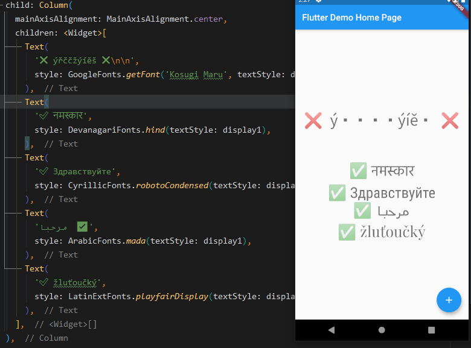

# google_language_fonts

**Say no more to:**


This unofficial [`google_language_fonts` package](https://pub.dev/packages/google_language_fonts) is an extension of the [`google_fonts` package](https://pub.dev/packages/google_fonts) and it allows you to easily use more than 950 fonts
(and their variants) from [fonts.google.com](https://fonts.google.com/) in your Flutter app. These fonts are matched with the **26 languages** listed below so you can use them right away from your IDE.

To use it as a language simply add `Fonts` suffix to any of these currently supported languages:
 - **Arabic**
 - Bengali
 - **Cyrillic**
 - CyrillicExt
 - **Devanagari**
 - **Greek**
 - GreekExt
 - Gujarati
 - Gurmukhi
 - **Hebrew**
 - **ChineseSimpl** (*ChineseSimplified*)
 - **Japanese**
 - Kannada
 - Khmer
 - **Korean**
 - **Latin**
 - LatinExt
 - Malayalam
 - Myanmar
 - Oriya
 - Sinhala
 - Tamil
 - Telugu
 - **Thai**
 - Tibetan
 - **Vietnamese**

**This package is compatible with the official [`google_fonts`](https://pub.dev/packages/google_fonts) package. All fonts of GoogleFonts class are not
globally accessible due to faster IDE auto-suggestion fetching and to not clash with official package. However you can
still call it dynamically: `GoogleFonts.getFont('Lato')`.**

**NOTE**: The initial version is 0.1.0. Bugs might be present or breaking changes might be introduced.

## Getting Started



With the `google_language_fonts` package, `.ttf` or `.otf` files do not need to be stored in your assets folder and mapped in
the pubspec. Instead, they can be fetched once via http at runtime, and cached in the app's file system. This is ideal for development, and can be the preferred behavior for production apps that
are looking to reduce the app bundle size. Still, you may at any time choose to include the font file in the assets, and the Google Fonts package will prioritize pre-bundled files over http fetching.
Because of this, the Google Fonts package allows developers to choose between pre-bundling the fonts and loading them over http, while using the same API.

For example, say you want to use any of the [Cyrillic](https://fonts.google.com/?sort=popularity&subset=cyrillic) fonts from Google Fonts in your Flutter app. You would need to open the website and then copy one by one until you find what satisfy your needs. With this package, you can try your fonts right away thanks to the IDE auto-suggestions.

First, add the `google_language_fonts` package to your [pubspec dependencies](https://pub.dev/packages/google_language_fonts#-installing-tab-).

To import any of the `LanguageFonts`, for example `LatinFonts`:

```dart
import 'package:google_language_fonts/google_fonts.dart';
```

To use for example `LatinFonts` with the default TextStyle:

```dart
Text(
  'This is Google Fonts',
  style: LatinFonts.playfairDisplay(),
),
```

Or, if you want to load the font dynamically:

```dart
Text(
  'This is Google Fonts',
  style: GoogleFonts.getFont('Lato'),
),
```

To use `GoogleFonts` with an existing `TextStyle`:

```dart
Text(
  'This is Google Fonts',
  style: CyrillicFonts.robotoCondensed(
    textStyle: TextStyle(color: Colors.blue, letterSpacing: .5),
  ),
),
```

or

```dart
Text(
  'This is Google Fonts',
  style: CyrillicFonts.robotoCondensed(textStyle: Theme.of(context).textTheme.display1),
),
```

To override the `fontSize`, `fontWeight`, or `fontStyle`:

```dart
Text(
  'This is Google Fonts',
  style: LatinFonts.playfairDisplay(
    textStyle: Theme.of(context).textTheme.display1,
    fontSize: 48,
    fontWeight: FontWeight.w700,
    fontStyle: FontStyle.italic,
  ),
),
```

You can also use for example `CyrillicFonts.robotoCondensedTextTheme()` to make or modify an entire text theme to use the "robotoCondensedTextTheme" font.

```dart
MaterialApp(
  theme: ThemeData(
    textTheme: CyrillicFonts.robotoCondensedTextTheme(
      Theme.of(context).textTheme,
    ),
  ),
);
```

Or, if you want a `TextTheme` where a couple of styles should use a different font:

```dart
final textTheme = Theme.of(context).textTheme;

MaterialApp(
  theme: ThemeData(
    textTheme: CyrillicFonts.robotoCondensedTextTheme(textTheme).copyWith(
      body1: ArabicFonts.mada(textStyle: textTheme.body1),
    ),
  ),
);
```

### Bundling font files in your application's assets

The `google_language_fonts` package will automatically use matching font files in your `pubspec.yaml`'s
`assets` (rather than fetching them at runtime via HTTP). Once you've settled on the fonts
you want to use:

1. Download the font files from [https://fonts.google.com](https://fonts.google.com).
You only need to download the weights and styles you are using for any given family.
Italic styles will include `Italic` in the filename. Font weights map to file names as follows:

```dart
{
  FontWeight.w100: 'Thin',
  FontWeight.w200: 'ExtraLight',
  FontWeight.w300: 'Light',
  FontWeight.w400: 'Regular',
  FontWeight.w500: 'Medium',
  FontWeight.w600: 'SemiBold',
  FontWeight.w700: 'Bold',
  FontWeight.w800: 'ExtraBold',
  FontWeight.w900: 'Black',
}
```

2. Move those fonts to a top-level app directory (e.g. `google_fonts`).


3. Ensure that you have listed the folder (e.g. `google_fonts/`) in your `pubspec.yaml` under `assets`.


Note: Since these files are listed as assets, there is no need to list them in the `fonts` section
of the `pubspec.yaml`. This can be done because the files are consistently named from the Google Fonts API
(so be sure not to rename them!)

### Licensing Fonts
The fonts on [fonts.google.com](https://fonts.google.com/) include license files for each font. For
example, the [Lato](https://fonts.google.com/specimen/Lato) font comes with an `OFL.txt` file.

Once you've decided on the fonts you want in your published app, you should download and add the appropriate
licenses to your flutter app's [LicenseRegistry](https://api.flutter.dev/flutter/foundation/LicenseRegistry-class.html).

For example:
```dart
void main() {
  LicenseRegistry.addLicense(() async* {
    final license = await rootBundle.loadString('google_fonts/OFL.txt');
    yield LicenseEntryWithLineBreaks(['google_fonts'], license);
  });
  
  runApp(...);
}
```
